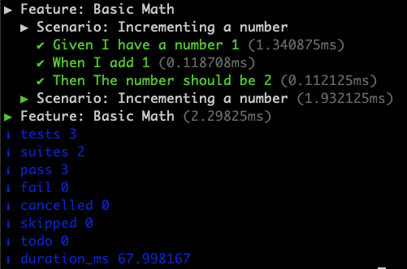

# @bonniernews/node-test-bdd

**Node Test BDD** is a Gherkin/Cucumber-style testing framework for Node.js, designed to work seamlessly with the [Node test runner](https://nodejs.org/api/test.html#test-runner).  

It serves as a drop-in replacement for [Mocha Cakes 2](https://www.npmjs.com/package/mocha-cakes-2) for users transitioning from [Mocha](https://mochajs.org/) to Node's native test runner.

## 🚀 Quick Start  

Install the package:

```sh
npm install --save-dev @bonniernews/node-test-bdd
```

Write your first test:

```js
import assert from "node:assert";
import { Feature, Scenario, Given, When, Then } from "@bonniernews/node-test-bdd";

Feature("Basic Math", () => {
  Scenario("Incrementing a number", () => {
    let number = 1;

    Given("I have a number 1", () => {
      assert.strictEqual(number, 1);
    });

    When("I add 1", () => {
      number += 1;
    });

    Then("The number should be 2", () => {
      assert.strictEqual(number, 2);
    });
  });
});
```

Run the test using Node's built-in test runner:

```sh
node --test
```

The output should look like this:



## Installation

Install as a development dependency:

```sh
npm install --save-dev @bonniernews/node-test-bdd
```

## Usage

Node Test BDD provides Gherkin-style syntax for defining tests:

```js
import assert from "node:assert";
import { Feature, Scenario, Given, When, Then, And } from "@bonniernews/node-test-bdd";

Feature("Example feature", () => {
  Scenario("Example scenario", () => {
    let number;
    Given("I have a number", () => {
      number = 1;
    });
    And("That number is 1", () => {
      assert.ok(number === 1);
    });
    When("Adding 1 to that number", () => {
      number += 1;
    });
    Then("The number should be 2", () => {
      assert.ok(number === 2);
    });
  });
});
```

### Register the BDD test functions globally

To avoid importing BDD functions in every test file, you can register them globally:

Option 1: Import in your test setup file

```js
import "@bonniernews/node-test-bdd/register-bdd";
```

Option 2: Import dynamically when running tests

```shell
node --test --import '@bonniernews/node-test-bdd/register-bdd'
```

## API

Node Test BDD provides the following test functions:

* `Feature(description, fn)`
  * `Scenario(description, fn)`
    * `Given(description, fn)`
    * `When(description, fn)`
    * `Then(description, fn)`
    * `And(description, fn)`
    * `But(description, fn)`

### Scenario Hooks

You can use hooks to set up and clean up before and after each scenario.

```js
Feature("Some feature", () => {
  beforeEachScenario(() => {
    someSetup();
  });

  afterEachScenario(() => {
    doCleanup();
  });

  Scenario("First scenario", () => {
    // Test logic...
  });

  Scenario("Second scenario", () => {
    // Test logic...
  });
});
```

### `.skip`

Skips a test clause. Works on all test functions.

```js
Feature("feature", () => {
  Scenario.skip("a skipped scenario", () => {
    // Test logic...
  });
  Scenario("scenario", () => {
    // Test logic...
  });
});
```

## Migrating from Mocha

If your Mocha test suite runs sequentially (without parallelism), you should consider setting the [`--experimental-test-isolation`](https://nodejs.org/docs/latest-v22.x/api/cli.html#--experimental-test-isolationmode) flag to `none`.  

This ensures that:
- All test files run in the same process as the test runner.
- The `--test-concurrency` flag is automatically set to `1`, mimicking Mocha’s default behavior.

### Mocha vs. Node.js Test Runner Options

| Mocha Option | Equivalent in Node.js Test Runner |
| ------------------- | -------------------------------------------------------------------------------------------------------------------------------------| 
| [--exit](https://mochajs.org/#-exit)                            | [--test-force-exit](https://nodejs.org/docs/latest-v22.x/api/cli.html#--test-force-exit) |
| [--require](https://mochajs.org/#-require-module-r-module)      | [--import](https://nodejs.org/docs/latest-v22.x/api/cli.html#--importmodule)             |
| [--timeout](https://mochajs.org/#-timeout-ms-t-ms)              | [--test-timeout](https://nodejs.org/docs/latest-v22.x/api/cli.html#--test-timeout)       |
